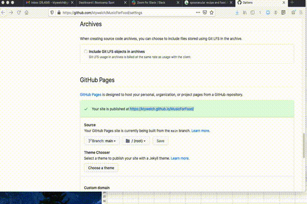

## Table of contents
* [Use Case](#use-case)
* [Application Objective](#application-objective)
* [Functionality](#functionality)
* [Setup](#setup)
* [Technologies Used](#technologies-used)
* [Developers: Javascript-Jockies](#Developers:-Javascript-Jockies)

## Use Case

The coronavirus outbreak has rattled our daily lives, and things seem to change minute by minute. But there’s one constant; we have to eat. If your bored by your ususal dishes?  Give the app a chance to try out new recipes and music! 

In this app we’re exploring how we cook and you can listen to music to match your cuisne!

----
## Application Objective

The goal of the project was to create a website that searches for recipes and music depending on what cuisine of your choice so that the user is provide a playlist from that same ethnic culture. Thus giving the User a full immersed experience and feeling of that culture.

[MusicForFood Application Link](https://ktywelch.github.io/MusicForFood/assets/html/first-page.html)

## Functionality
The user will have the ability to:

* Select a culture we would like to get a recipe from
* After selecting the culture I will be presented with a choice of recipes for this culture.
* Once I select the recipe I will see the recipe and a playlist that is associated with the culter
* The user can contact us through a contact application 
* Information about our apps can be found in a common about method.

This GIF shows the user interface and how the application utilizeslocal storage.

----
## Setup 

This application uses the Deezer API through [Rapid API](https://rapidapi.com/) and a direct api from [Spoonacular](https://spoonacular.com/food-api) and the keys should be obtained by the installer so they are using unique keys. The keys for the application can be found in the MusicForFood.js file preceeded by a commend "API Variables section". Otherwise the application is self contained using internal variables, local storage and the afore mentioned APIs. 

# MusicForFood - [Link](https://ktywelch.github.io/MusicForFood/assets/html/first-page.html)

## Technologies Used
- Bulma for CSS
- Javascript
- Jquery
- Google Icons and Fonts api
- Deezer API
- Spoonacular API
- Github
- Lucid App
- Jam Board
- Postman

## Developers: Javascript-Jockies
- Kathleen Welch
- Christian Suchoski
- Geoffrey Jiang
- Clinton Chunga

